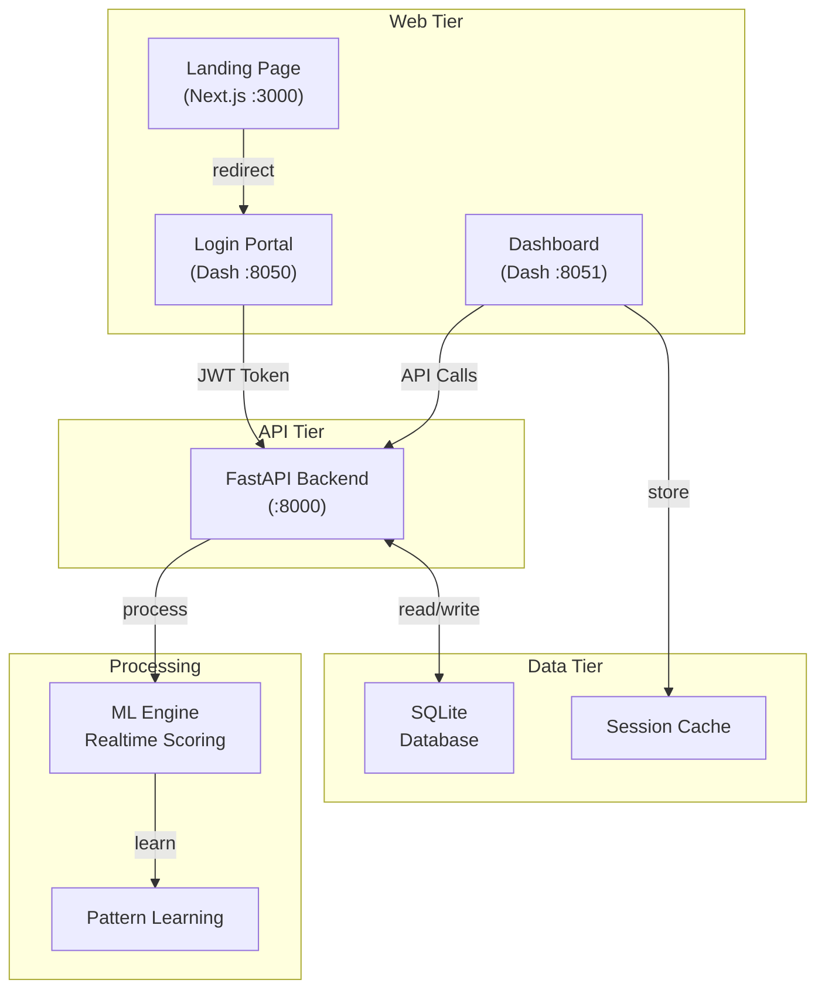
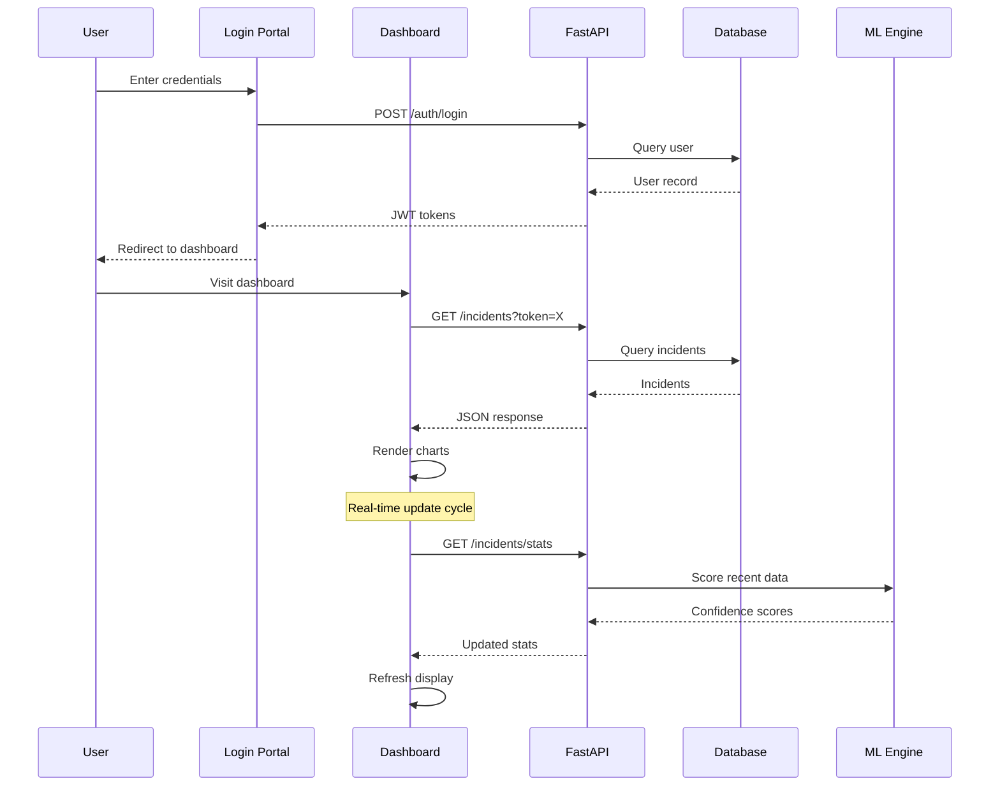

# System Architecture

**Version:** 2.1.2 | **Updated:** January 29, 2026

---

## High-Level Architecture



---

## Component Interaction Diagram



---

## Backend Architecture

### API Server

**Framework:** FastAPI 0.109+
**Protocol:** HTTP/REST
**Documentation:** Auto-generated Swagger UI at `/docs`
**Health Check:** GET `/health` returns `{"status": "healthy"}`

### Authentication System

```
┌─────────────────────────────────────────┐
│ Authentication Pipeline                 │
├─────────────────────────────────────────┤
│ 1. User → POST /auth/login              │
│ 2. Validate email + password (bcrypt)   │
│ 3. Create access token (30 min, HS256)  │
│ 4. Create refresh token (7 days, HS256) │
│ 5. Return tokens to client              │
│                                         │
│ Subsequent requests:                    │
│ 1. Client → Bearer {access_token}       │
│ 2. Backend verifies JWT signature       │
│ 3. Extract user_id from claims          │
│ 4. Return 401 if expired/invalid        │
│                                         │
│ Token refresh:                          │
│ 1. Client → POST /auth/refresh          │
│ 2. Validate refresh token               │
│ 3. Issue new access token               │
│ 4. Refresh token unchanged              │
└─────────────────────────────────────────┘
```

### Role-Based Access Control (RBAC)

| Role | Permissions |
|------|-------------|
| **admin** | Create/read/update/delete all incidents, manage users |
| **manager** | Create/read/update incidents, assign to operators |
| **operator** | Read/update incidents assigned to them |
| **viewer** | Read-only access to dashboard |

### Database Schema

#### Users Table
```sql
users (
  id INTEGER PRIMARY KEY AUTO_INCREMENT,
  email VARCHAR(255) UNIQUE NOT NULL,
  username VARCHAR(50) UNIQUE NOT NULL,
  hashed_password VARCHAR(255) NOT NULL,
  full_name VARCHAR(100),
  role ENUM('admin','manager','operator','viewer'),
  is_active BOOLEAN DEFAULT TRUE,
  created_at TIMESTAMP DEFAULT CURRENT_TIMESTAMP,
  updated_at TIMESTAMP DEFAULT CURRENT_TIMESTAMP ON UPDATE CURRENT_TIMESTAMP,
  last_login TIMESTAMP NULL,

  INDEX idx_email (email),
  INDEX idx_username (username)
);
```

#### Incidents Table
```sql
incidents (
  id INTEGER PRIMARY KEY AUTO_INCREMENT,
  property_id VARCHAR(100) NOT NULL,
  school_name VARCHAR(255) NOT NULL,
  confidence FLOAT NOT NULL CHECK (confidence >= 0 AND confidence <= 100),
  signals JSON NOT NULL,  -- {"MNF": 0.85, "RESIDUAL": 0.92, ...}
  status ENUM('open','acknowledged','watching','escalated','resolved','ignored'),
  assigned_to INTEGER,
  cost_estimate FLOAT DEFAULT 0,
  notes TEXT,
  created_at TIMESTAMP DEFAULT CURRENT_TIMESTAMP,
  updated_at TIMESTAMP DEFAULT CURRENT_TIMESTAMP ON UPDATE CURRENT_TIMESTAMP,

  FOREIGN KEY (assigned_to) REFERENCES users(id),
  INDEX idx_school_name (school_name),
  INDEX idx_status (status),
  INDEX idx_created_at (created_at)
);
```

#### Action Log Table (Audit)
```sql
action_logs (
  id INTEGER PRIMARY KEY AUTO_INCREMENT,
  user_id INTEGER NOT NULL,
  incident_id INTEGER,
  action VARCHAR(50) NOT NULL,  -- 'acknowledge','resolve','assign','etc'
  old_value JSON,
  new_value JSON,
  created_at TIMESTAMP DEFAULT CURRENT_TIMESTAMP,

  FOREIGN KEY (user_id) REFERENCES users(id),
  INDEX idx_user_id (user_id),
  INDEX idx_incident_id (incident_id)
);
```

### API Endpoints

**Base URL:** `http://localhost:8000/api/v1`

#### Authentication Endpoints

```
POST /auth/register
  Body: { email, username, password, full_name }
  Response: { id, email, username, role, created_at }
  Status: 201 Created | 400 Bad Request

POST /auth/login
  Body: { email, password }
  Response: { access_token, refresh_token, token_type }
  Status: 200 OK | 401 Unauthorized

POST /auth/refresh
  Body: { refresh_token }
  Response: { access_token, token_type }
  Status: 200 OK | 401 Unauthorized

GET /auth/me
  Headers: Authorization: Bearer {token}
  Response: { id, email, username, role, created_at }
  Status: 200 OK | 401 Unauthorized

POST /auth/logout
  Headers: Authorization: Bearer {token}
  Response: { message: "Logged out successfully" }
  Status: 200 OK
```

#### Incidents Endpoints

```
GET /incidents/
  Query: ?skip=0&limit=10&status=open&school_name=ABC&sort_by=created_at
  Headers: Authorization: Bearer {token}
  Response: { total, items: [{id, property_id, school_name, confidence, status, ...}] }
  Status: 200 OK

GET /incidents/stats
  Headers: Authorization: Bearer {token}
  Response: {
    total_incidents: 42,
    by_status: {open: 15, resolved: 20, ...},
    avg_confidence: 78.5,
    schools_with_alerts: 12
  }
  Status: 200 OK

POST /incidents/
  Body: { property_id, school_name, confidence, signals }
  Headers: Authorization: Bearer {token}
  Response: { id, created_at, ... }
  Status: 201 Created

GET /incidents/{id}
  Headers: Authorization: Bearer {token}
  Response: { id, property_id, school_name, ... }
  Status: 200 OK | 404 Not Found

PATCH /incidents/{id}
  Body: { status, assigned_to, cost_estimate, notes }
  Headers: Authorization: Bearer {token}
  Response: { id, updated_at, ... }
  Status: 200 OK | 404 Not Found

DELETE /incidents/{id}
  Headers: Authorization: Bearer {token}
  Response: { message: "Incident deleted" }
  Status: 200 OK | 404 Not Found
```

#### Schools Endpoints

```
GET /schools/
  Headers: Authorization: Bearer {token}
  Response: { total, items: [{id, name, location, coordinates, ...}] }
  Status: 200 OK

GET /schools/search
  Query: ?q=ABC School&location=Sydney
  Headers: Authorization: Bearer {token}
  Response: { items: [{id, name, ...}] }
  Status: 200 OK

GET /schools/alerts
  Headers: Authorization: Bearer {token}
  Response: { items: [{id, name, active_alerts: 3, ...}] }
  Status: 200 OK
```

---

## Frontend Architecture

### Dashboard Structure

**Framework:** Dash (Plotly)
**Port:** 8051
**Theme:** UI UX Pro Max + Deep Ocean

### Tab-Based Layout

```
┌─────────────────────────────────────────┐
│ WaterWatch Dashboard                    │
├──────┬──────────┬──────┬──────┬──────────┤
│ Logo │ Overview │ Events│ Log  │ GIS Map │
├─────────────────────────────────────────┤
│                                         │
│ [Tab Content - Dynamic]                 │
│                                         │
│ [Charts / Tables / Filters]             │
│                                         │
└─────────────────────────────────────────┘
```

### Tab Layouts

#### Overview Tab
- **KPI Cards:** Total incidents, Avg confidence, Schools affected, This week
- **Status Distribution:** Pie chart (open, resolved, watching, etc.)
- **Time Series:** Incident creation over 7 days
- **Confidence Distribution:** Histogram (0-100%)

#### Events Tab
- **Incident Cards:** Grid layout with school, confidence, status
- **Action Buttons:** Acknowledge, Watch, Escalate, Resolve, Ignore
- **Filters:** Status, school name, date range, confidence threshold
- **Pagination:** 10-50 items per page

#### Log Tab
- **Audit Table:** User, action, incident, timestamp
- **Filters:** User, action type, date range
- **Export:** CSV download

#### GIS Map Tab
- **Leaflet Map:** NSW centered
- **Markers:** 50 demo schools with color coding
  - Green: No alerts
  - Yellow: Watching
  - Red: Alert (confidence >70%)
- **Toggle:** All schools vs. alert-only
- **Click:** Show school details popup

### Login Portal (Separate App)

**Port:** 8050
**Theme:** Deep Ocean (navy/cyan, glassmorphism, Hydro-Pulse loader)
**Features:**
- Email/password form (300px width)
- Remember me checkbox
- Links to landing page & demo
- Error handling with retry

### ML Engine (Model_1_realtime_simulation.py)

```python
def calculate_confidence(signals: dict) -> float:
    """
    Multi-signal weighted scoring.

    Args:
        signals: {
            'MNF': 0-100,
            'RESIDUAL': 0-100,
            'CUSUM': 0-100,
            'AFTERHRS': 0-100,
            'BURSTBF': 0-100
        }

    Returns:
        Confidence score: 0-100%
    """
    weights = {
        'MNF': 0.4,
        'RESIDUAL': 0.2,
        'CUSUM': 0.2,
        'AFTERHRS': 0.1,
        'BURSTBF': 0.1
    }

    confidence = sum(
        signals.get(key, 0) * weight
        for key, weight in weights.items()
    )

    return min(100, max(0, confidence))
```

### Pattern Learning

**File:** `false_alarm_patterns.py`
**Logic:**
1. Track incidents marked as "Ignored" or "Resolved without action"
2. Extract pattern signature (school, time, consumption profile)
3. Store in CSV: `False_Alarm_Patterns.csv`
4. On next scoring, check new patterns against learned false alarms
5. If match found, reduce confidence by 20-30%

---

## Data Flow Architecture

### Incident Creation Flow

```
User (Web Browser)
  │
  ├─→ POST /incidents/ with data
  │   └─→ FastAPI endpoint handler
  │       ├─ Validate request (Pydantic)
  │       ├─ Check user authorization (RBAC)
  │       ├─ Write to SQLite
  │       └─ Return incident ID
  │
  └─→ Dashboard polls GET /incidents/stats
      └─→ FastAPI aggregates from DB
          └─→ Dashboard renders updated stats
```

### Real-Time Scoring Flow

```
Water Meter Data (Excel)
  │
  ├─→ frontend/data.py (load + validate)
  │   └─ Normalizes 15-min intervals
  │
  ├─→ frontend/processing.py (transform)
  │   └─ Calculates 28-day baseline
  │   └─ Identifies anomalies
  │
  ├─→ Model_1_realtime_simulation.py (score)
  │   ├─ MNF calculation
  │   ├─ RESIDUAL calculation
  │   ├─ CUSUM control chart
  │   ├─ AFTERHRS analysis
  │   ├─ BURSTBF detection
  │   └─ Weighted aggregate → 0-100%
  │
  ├─→ false_alarm_patterns.py (filter)
  │   └─ Check learned patterns
  │   └─ Adjust confidence if match
  │
  ├─→ POST /incidents/ (create if >threshold)
  │   └─ FastAPI stores in DB
  │
  └─→ Dashboard displays
      └─ Real-time updates via polling
```

---

## Async Processing

### Async Stack

**Framework:** SQLAlchemy 2.0 async ORM
**Driver:** aiosqlite (async SQLite)
**Event Loop:** asyncio

```python
# Example async endpoint
@router.get("/incidents/")
async def list_incidents(
    skip: int = 0,
    limit: int = 10,
    current_user: User = Depends(get_current_user),
    session: AsyncSession = Depends(get_db)
):
    """Async endpoint with database query."""
    result = await session.execute(
        select(Incident)
        .offset(skip)
        .limit(limit)
        .order_by(Incident.created_at.desc())
    )
    incidents = result.scalars().all()
    return {"items": incidents, "total": len(incidents)}
```

---

## Security Architecture

### Password Security

```
User enters password
  │
  ├─→ passlib (bcrypt algorithm)
  │   └─ 12 rounds of hashing + salt
  │   └─ Hash stored in DB
  │
  ├─→ Login verification
  │   ├─ User password + stored salt → hash
  │   ├─ Compare with stored hash
  │   └─ Return True/False
```

### Token Security

```
JWT Structure: header.payload.signature

Header: { "alg": "HS256", "typ": "JWT" }
Payload: {
  "sub": user_id,
  "email": user_email,
  "role": user_role,
  "exp": timestamp_30_mins,
  "iat": timestamp_now
}
Signature: HMAC-SHA256(header.payload, SECRET_KEY)
```

### CORS Policy

**Allowed Origins:**
- http://localhost:8050 (login portal)
- http://127.0.0.1:8050
- http://localhost:8051 (dashboard)
- http://127.0.0.1:8051

**Methods:** GET, POST, PATCH, DELETE, OPTIONS
**Headers:** * (all allowed)

---

## Deployment Topology

### Single-Server Architecture

```
┌─────────────────────────────────────────┐
│ Server (Windows/Linux/macOS)            │
├─────────────────────────────────────────┤
│                                         │
│ Process 1: FastAPI (:8000)              │
│   ├─ Handle API requests                │
│   ├─ Manage auth tokens                 │
│   └─ Query SQLite                       │
│                                         │
│ Process 2: Dash Dashboard (:8051)       │
│   ├─ Serve interactive UI                │
│   ├─ Store session data                 │
│   └─ Call FastAPI endpoints             │
│                                         │
│ Process 3: Dash Login Portal (:8050)    │
│   ├─ Serve login form                   │
│   └─ Redirect to dashboard              │
│                                         │
│ Database: SQLite (leak_detection.db)    │
│   ├─ Users table                        │
│   ├─ Incidents table                    │
│   └─ Action logs table                  │
│                                         │
└─────────────────────────────────────────┘
```

### Optional Next.js Landing Page (:3000)

Separate Node.js process (not required for core functionality)

---

## Performance Optimization

### Database Indexes

```sql
-- Fast lookups by email (login)
CREATE INDEX idx_users_email ON users(email);

-- Fast lookups by username
CREATE INDEX idx_users_username ON users(username);

-- Fast filtering by status
CREATE INDEX idx_incidents_status ON incidents(status);

-- Fast filtering by school
CREATE INDEX idx_incidents_school_name ON incidents(school_name);

-- Fast sorting by date
CREATE INDEX idx_incidents_created_at ON incidents(created_at DESC);
```

### Caching Strategy

- **Incident stats:** Cached for 5 minutes on frontend
- **School list:** Static JSON, cached on startup
- **User sessions:** Stored in Dash memory store
- **ML scores:** Computed on-demand (not cached)

### Query Optimization

```python
# Efficient: Single query with join
result = await session.execute(
    select(Incident)
    .where(Incident.school_name == 'ABC School')
    .options(selectinload(Incident.assigned_user))
)

# Avoid: N+1 query pattern
incidents = await session.execute(select(Incident))
for incident in incidents:
    user = await session.get(User, incident.assigned_to)  # Repeated queries!
```

---

## Scalability Considerations

### Current Limitations

- **SQLite:** Single-file, not suitable for >100k records
- **Single server:** No horizontal scaling
- **Memory:** Dashboard stores data in RAM (limited to server memory)

### Migration Path (v2.3+)

```
SQLite → PostgreSQL
  ├─ Better concurrency control
  ├─ Support for larger datasets
  └─ Enable read replicas for scaling

Single Server → Multi-Server
  ├─ Load balancer (nginx)
  ├─ Multiple API instances
  ├─ Shared database (PostgreSQL)
  └─ Session store (Redis)
```

---

## Related Documentation

- [Code Standards](./code-standards.md) - Implementation conventions
- [Deployment Guide](./deployment-guide.md) - Setup & operations
- [Project Overview](./project-overview-pdr.md) - Requirements & goals
